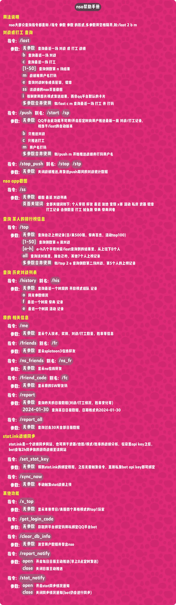

<div align="center">
  <a href="https://v2.nonebot.dev/store"></a>
  <br>
  <p></p>
</div>

<div align="center">

# nonebot-plugin-splatoon3-nso

_✨ splatoon3 nso查询插件 ✨_

<p align="center">
<a href="./LICENSE">
    
</a>
<a href="https://pypi.python.org/pypi/nonebot-plugin-splatoon3-nso">
  
</a>
<a href="https://pypi.python.org/pypi/nonebot-plugin-splatoon3-nso">
    
</a>

<br />
<a href="https://onebot.dev/">
  
</a>
<a href="https://onebot.dev/">
  
</a>
<a href="https://github.com/nonebot/adapter-telegram">

</a>
<a href="https://github.com/Tian-que/nonebot-adapter-kaiheila">

</a>
<a href="https://github.com/nonebot/adapter-qq">

</a>
</p>

</div>

## 📖 介绍

- 一个基于nonebot2框架的splatoon3
  nso查询插件,支持onebot11,onebot12,[telegram](https://github.com/nonebot/adapter-telegram)
  协议,[kook](https://github.com/Tian-que/nonebot-adapter-kaiheila)
  协议,[QQ官方bot](https://github.com/nonebot/adapter-qq)协议
- 本仓库代码是基于paul的[splatoon3-bot](https://github.com/paul-sama/splatoon3-bot)内的nso插件进行的重构版本
- 建议配合我做的[日程查询插件](https://github.com/Cypas/splatoon3-schedule)一起使用

>
也可以邀请我目前做好的小鱿鱿bot直接加入kook频道或qq群聊，[kook频道bot](https://www.kookapp.cn/app/oauth2/authorize?id=22230&permissions=4096&client_id=4Kn4ukf1To48rax8&redirect_uri=&scope=bot),[qq群聊bot](https://qun.qq.com/qunpro/robot/qunshare?robot_appid=102083290&robot_uin=3889005657)

> 小鱿鱿官方kook频道:[kook频道](https://kook.top/mkjIOn)

## 💿 安装

### 前置环境

- python3.10或以上版本
- 本地或远程的redis数据库

### 插件安装

<details>
<summary>使用 nb-cli 安装</summary>
在 nonebot2 项目的根目录下打开命令行, 输入以下指令即可安装

    nb plugin install nonebot-plugin-splatoon3-nso

</details>


<details>
<summary>使用包管理器安装</summary>
在 nonebot2 项目的插件目录下, 打开命令行, 根据你使用的包管理器, 输入相应的安装命令
<details>
<summary>pdm</summary>

    pdm add nonebot-plugin-splatoon3-nso

</details>

<details>
<summary>poetry</summary>

    poetry add nonebot-plugin-splatoon3-nso

</details>


</details>

## ⚙️ 配置

以下配置项均为可选值，根据自己需要将配置项添加至nonebot目录的`.env.prod`文件

|                   配置项                    | 必填 | 值类型  |                                                   默认值                                                    |                            说明                             |
|:----------------------------------------:|:--:|:----:|:--------------------------------------------------------------------------------------------------------:|:---------------------------------------------------------:|
|         splatoon3_proxy_address          | 否  | str  |                                                    ""                                                    |          代理地址，格式为 127.0.0.1:20171(该配置项与日程查询插件公用)          |
|           splatoon3_reply_mode           | 否  | bool |                                                  False                                                   |      指定回复模式，开启后将通过触发词的消息进行回复，默认为False(该配置项与日程查询插件公用)      |
|        splatoon3_proxy_list_mode         | 否  | bool |                                                   True                                                   | 局部域名代理模式,具体依据自己服务器对各个域名的访问情况进行设置，默认True，False情况为全部域名请求走代理 |
|           splatoon3_proxy_list           | 否  | list | [见源码](https://github.com/Cypas/splatoon3-nso/blob/master/nonebot_plugin_splatoon3_nso/config.py#L14-L23) |                         局部域名代理列表                          |
| splatoon3_schedule_plugin_priority_mode  | 否  | bool |                                                  False                                                   |        日程插件的帮助菜单优先模式(会影响帮助菜单由哪个插件提供，该配置项与日程查询插件公用)        |
|          splatoon3_kk_guild_id           | 否  | str  |                                                    ""                                                    |              Q群在进行登录时，将用户引导至kook平台完成登录的服务器id              |
|     splatoon3_bot_disconnect_notify      | 否  | bool |                                                   True                                                   |                      bot上线，掉线时通知到频道                       |
|           splatoon3_qq_md_mode           | 否  | bool |                                                  False                                                   |  部分消息使用qq平台md卡片,开启了也没用，md模版需要在qqbot端进行审核，模板id目前在代码里是写死的   |
| splatoon3_unknown_command_fallback_reply | 否  | bool |                                                   True                                                   |                       没有匹配命令时是否兜底回复                       |
|        splatoon3_notify_tg_bot_id        | 否  | str  |                                                    ""                                                    |                 日志消息将由该bot发送至tg频道，不填就不会发送                 |
|     splatoon3_tg_channel_msg_chat_id     | 否  | str  |                                                    ""                                                    |                       msg消息的tg通知频道                        |
|     splatoon3_tg_channel_job_chat_id     | 否  | str  |                                                    ""                                                    |                       job消息的tg通知频道                        |
|        splatoon3_notify_kk_bot_id        | 否  | str  |                                                    ""                                                    |                日志消息将由该bot发送至kook频道，不填就不会发送                |
|     splatoon3_kk_channel_msg_chat_id     | 否  | str  |                                                    ""                                                    |                      msg消息的kook通知频道                       |
|     splatoon3_kk_channel_job_chat_id     | 否  | str  |                                                    ""                                                    |                      job消息的kook通知频道                       |
|            splatoon3_redis_ip            | 否  | str  |                                                    ""                                                    |                redis用于缓存用户token数据，redis ip                |
|           splatoon3_redis_port           | 否  | str  |                                                    ""                                                    |                         redis 端口                          |
|           splatoon3_redis_psw            | 否  | str  |                                                    ""                                                    |                         redis 密码                          |

<details>
<summary>示例配置</summary>

```env
# splatoon3-nso示例配置
splatoon3_proxy_address = "" #代理地址
splatoon3_reply_mode = False #指定回复模式
splatoon3_proxy_list_mode = True #局部域名代理模式,具体依据自己服务器对各个域名的访问情况进行设置，默认True，False情况为全部域名请求走代理
splatoon3_proxy_list = ["accounts.nintendo.com", "api.accounts.nintendo.com", "api-lp1.znc.srv.nintendo.net"] #局部域名代理列表
splatoon3_schedule_plugin_priority_mode = False #日程插件的帮助菜单优先模式(会影响帮助菜单由哪个插件提供，该配置项与日程查询插件公用)
splatoon3_kk_guild_id = "" #Q群在进行登录时，将用户引导至kook平台完成登录的服务器id
splatoon3_bot_disconnect_notify = True #bot上线，掉线时通知到频道
splatoon3_qq_md_mode = False #部分消息使用qq平台md卡片,开启了也没用，md模版需要在qqbot端进行审核，模板id目前在代码里是写死的
splatoon3_unknown_command_fallback_reply = True  # 没有匹配命令时是否兜底回复
# 日志消息将由该bot发送至tg频道
splatoon3_notify_tg_bot_id = ""
splatoon3_tg_channel_msg_chat_id = ""
splatoon3_tg_channel_job_chat_id = ""
# 日志消息将由该bot发送至kook频道
splatoon3_notify_kk_bot_id = ""
splatoon3_kk_channel_msg_chat_id = ""
splatoon3_kk_channel_job_chat_id = ""
# redis数据库地址  用于缓存用户数据
# redis_ip
splatoon3_redis_ip: str = ""
# redis_port
splatoon3_redis_port: str|int = ""
# redis_psw
splatoon3_redis_psw: str = ""
```

</details>

## 🎉 使用

### 指令表

<details>
<summary>nso帮助菜单</summary>



</details>

## 第三方api的使用

nso查询过程中使用到了第三方的自动令牌生成接口

- 自动生成令牌需要向非 Nintendo 服务器发出安全请求，请求中包含最少的非识别信息。
- 我们力求对此 100% 透明，并提供有关安全和隐私的深入信息。

### 隐私声明

- 插件不会向第三方自动令牌接口，如[imink API](https://status.imink.app/)
  或[nxapi-znca-api](https://github.com/samuelthomas2774/nxapi-znca-api)发送任何身份信息。
- 用户名和密码与 API 的作用相距甚远，除了您之外，任何人都无法读取，返回的值不包含有关您帐户的任何有意义的信息。
- 无法使用发送或存储的数据来识别哪个帐户/用户执行了请求，无法查看有关用户的识别信息，也无法访问帐户。
- 有关更多信息，请参阅[imink API 隐私政策](https://github.com/JoneWang/imink/wiki/Privacy-Policy)
  和[文档](https://github.com/JoneWang/imink/wiki/imink-API-Documentation),[nxapi-znca-api 文档](https://github.com/samuelthomas2774/nxapi-znca-api/blob/main/docs/api.md).

## ✨喜欢的话就点个star✨吧，球球了QAQ

## 鸣谢

- [splatoon3-bot](https://github.com/paul-sama/splatoon3-bot) 本插件基于splatoon3-bot内的nso插件进行重构
- [s3si.ts](https://github.com/spacemeowx2/s3si.ts) 个人战绩同步上传至stat.ink的脚本
- https://github.com/imink-app/f-API 模拟nso授权步骤的公开接口
- https://github.com/samuelthomas2774/nxapi-znca-api 模拟nso授权步骤的公开接口

## ⏳ Star 趋势

[](https://starchart.cc/Cypas/splatoon3-nso)
